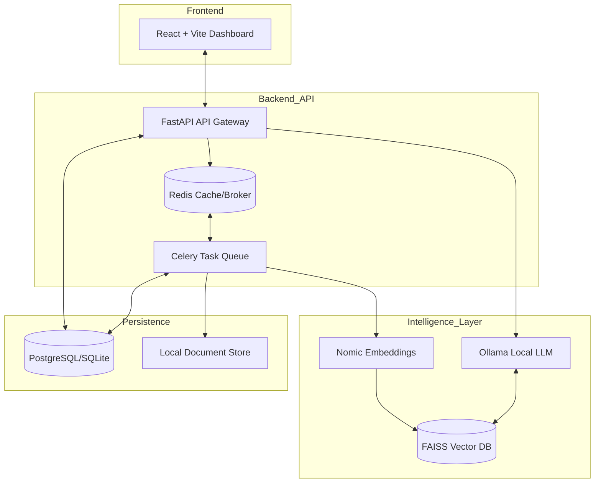

<div align="center">
  
  # 💡 Lumina
  
  **Your Open-Source, Privacy-First AI Wealth Manager**

  [](https://fastapi.tiangolo.com/)
  [](https://react.dev/)
  [](https://ollama.com/)
  [](https://www.docker.com/)
  [](https://opensource.org/licenses/MIT)

  *An intelligent financial dashboard that reads your documents, analyzes your spending, and answers complex financial questions using 100% local AI models.*

</div>

---

## 📖 Overview

**Lumina** is a self-hostable, full-stack application designed to replace cloud-based financial aggregators. By combining traditional deterministic financial tools with advanced generative AI and machine learning, it acts as your personal proactive financial advisor.

### Why Lumina?
- **Privacy First**: Your sensitive financial data never leaves your machine.
- **Sovereign AI**: Leverages local LLMs (Ollama) and local databases.
- **Hybrid Intelligence**: Combines LLMs (for reasoning) with deterministic Python scripts (for math).

---

## 🏗️ System Architecture

Lumina utilizes a modern, distributed architecture to handle intensive document processing and AI inference locally.



---

| Feature | Description | Tech Stack |
| :--- | :--- | :--- |
| **Intelligent Ingestion** | Native support for PDF (HDFC/Standard), **XLS/XLSX**, and TXT with automated OCR. | PyMuPDF, Pandas, Tesseract |
| **Hybrid Categorization** | 3-tier pipeline: Rule Engine → ML Classifier → Keyword Fallback with 79.3% accuracy. | Scikit-Learn, Regex |
| **RAG-Powered Chat** | Context-aware financial advice with 1.96 samples/sec throughput and zero manual effort. | FAISS, llama3.1, LangChain |
| **Recurring Detection** | Automatically identifies monthly subscriptions and recurring bills. | Python (Time-Series) |
| **Anomaly Detection** | Automated flagging of unusual transactions or billing errors. | Scikit-Learn (Isolation Forest) |
| **Glassmorphism UI** | Premium, modern dashboard with interactive charts and dark mode. | React, Tailwind, Recharts |

---

## 🏗️ Performance Benchmarks

Lumina is optimized for local performance. Detailed metrics can be found in [performance_metrics.md](file:///performance_metrics.md).

| Metric | Value |
| :--- | :--- |
| **RAG Throughput** | 1.96 samples/sec |
| **ML Label Quality** | 79.3% |
| **Data Privacy** | 100% Local |

---

## 🛠️ How it Works

### 1. The Ingestion Pipeline
When you upload a document (e.g., a bank statement or Excel ledger), Lumina triggers an asynchronous **Celery** task. The document is parsed, OCR is applied if necessary, and transactions are normalized into a standard ledger format stored in **PostgreSQL**.

### 2. Hybrid Categorization Pipeline
To ensure high accuracy without cloud APIs, Lumina uses a tiered approach:
1.  **Rule Engine**: High-precision regex rules for common Indian and Global merchants (95% confidence).
2.  **ML Classifier**: A Scikit-Learn model trained on structured features (amount, txn type) and TF-IDF text.
3.  **Keyword Scorer**: A weighted fallback mechanism for long-tail transaction descriptions.

### 3. Retrieval-Augmented Generation (RAG)
Text chunks from your documents are converted into high-dimensional vectors using the `nomic-embed-text` model and stored in a **FAISS** index. When you ask a question, Lumina retrieves the most relevant contexts to augment the prompt sent to **llama3.1**, ensuring accurate and cited answers.

### 3. Secure Computation
To avoid "AI Hallucinations" in math, Lumina uses a **deterministic tool-calling** layer. If a query requires calculating interest or ROI, the LLM generates a tool request which is executed in a secure, sandboxed Python environment.

---

## 🚦 Getting Started

### Prerequisites

1. **Python 3.10+**
2. **Node.js 18+** & `npm`
3. **[Ollama](https://ollama.com/)** (Required for the AI features)

### 1. Model Setup

```bash
ollama run llama3.1
ollama pull nomic-embed-text
```

### 2. Backend Setup
```bash
cd backend
python -m venv venv
.\venv\Scripts\activate  # Windows
# source venv/bin/activate  # Mac/Linux

pip install -r requirements.txt
cp .env.example .env  # Configure your secrets
uvicorn app.main:app --reload --port 8000
```

### 3. Frontend Setup
```bash
cd frontend
npm install
npm run dev
```

---

## 🛡️ Security & Privacy

Lumina is built from the ground up for data sovereignty:
- **Zero-Cloud**: No API keys required for OpenAI/Anthropic.
- **Local Persistence**: Data stays in your local SQLite/PostgreSQL instance.
- **PII Masking**: Integrated redaction for sensitive identifiers before processing.

---

## 🧪 Testing

Lumina has a full unit test suite covering all critical business logic. Tests run entirely offline — no Docker, no Ollama, no database required.

### Test Coverage

| Suite | File | Tests | What's Covered |
| :--- | :--- | :---: | :--- |
| **Categorization** | `test_categorization.py` | 35 | Rule engine, keyword scorer, merchant normalization, recurring detection, batch classify |
| **PII Masking** | `test_pii.py` | 25 | SSN/card/email/phone/account detection, redact/hash/token masking, `sanitize_for_llm` |
| **Financial Tools** | `test_tools.py` | 28 | Compound interest, loan amortization, tax estimate, savings goal, tool dispatcher |
| **JWT Security** | `test_security.py` | 17 | Password hashing, token creation, tamper detection, expiry, wrong-secret rejection |
| **RAG Chunking** | `test_rag_chunking.py` | 17 | Chunk sizing, overlap correctness, cosine similarity edge cases |
| **Anomaly Detection** | `test_ml_service_anomaly.py` | 7 | Z-score outlier flagging, multi-category isolation, schema validation |
| **Integration: Auth** | `test_auth.py` | 12 | Register, login, /me, refresh token — against in-memory SQLite |

**Total: 141 tests**

### Running Tests

Install test dependencies (separate from production requirements):

```bash
cd backend
pip install -r requirements-test.txt
```

Run all unit tests:

```bash
python -m pytest tests/unit/ -v
```

Run integration tests (no external services needed — uses in-memory SQLite):

```bash
python -m pytest tests/integration/ -v
```

Run everything:

```bash
python -m pytest -v
```

---

## 🤝 Contributing

Contributions are what make the open-source community an amazing place to learn, inspire, and create. Any contributions you make are **greatly appreciated**.

1. Fork the Project
2. Create your Feature Branch (`git checkout -b feature/AmazingFeature`)
3. Commit your Changes (`git commit -m 'Add some AmazingFeature'`)
4. Push to the Branch (`git push origin feature/AmazingFeature`)
5. Open a Pull Request

---

## 📜 License

Distributed under the MIT License. See `LICENSE` for more information.

<div align="center">
  <i>Built with ❤️ for privacy-conscious personal finance.</i>
</div>
